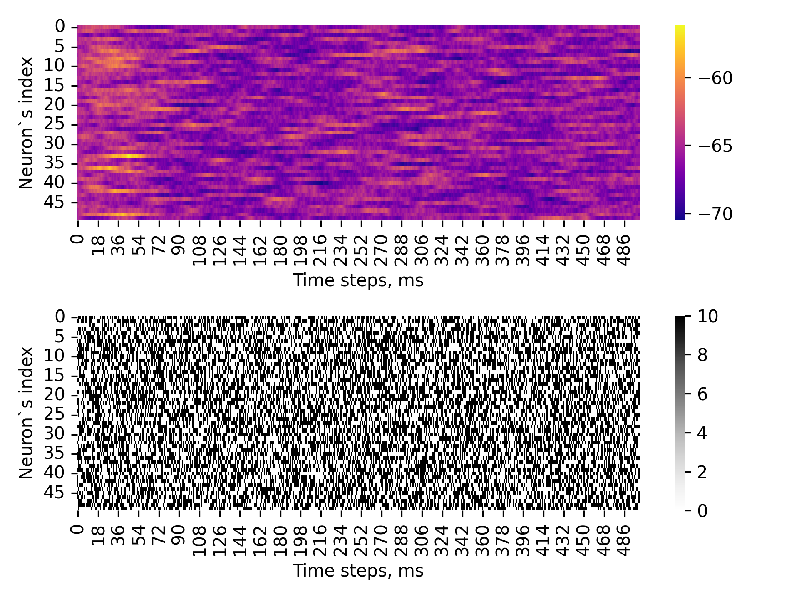
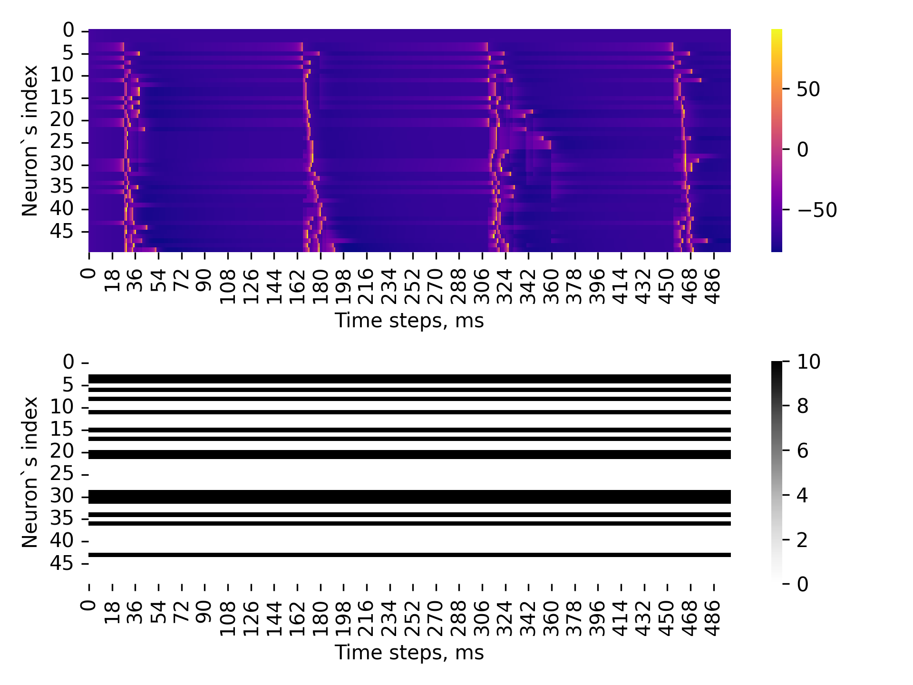
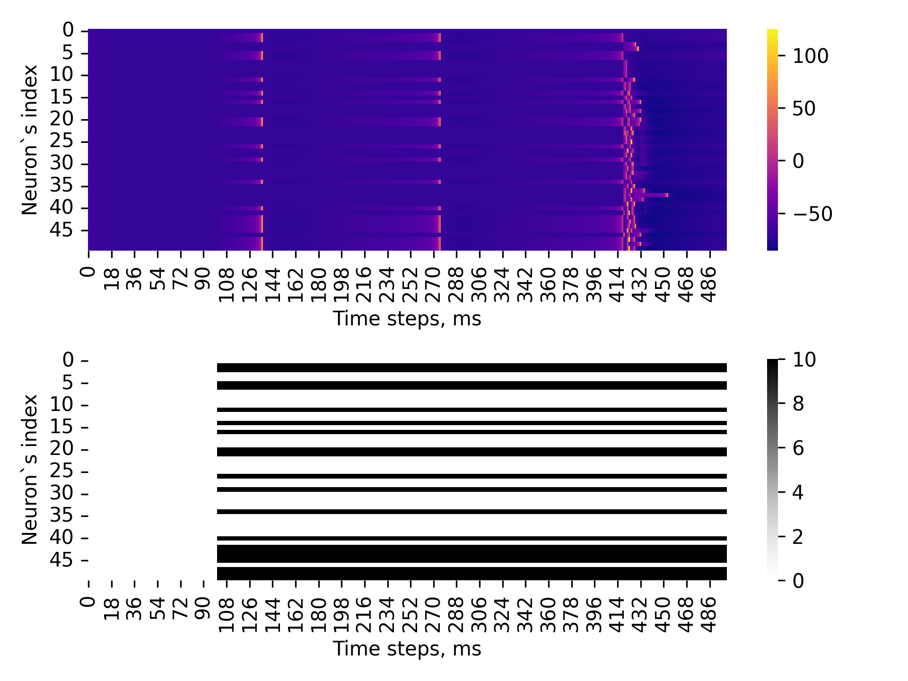

# smallworld_snn
## Описание
### Генератор спайков 1:


### Генератор спайков 2:


### Генератор спайков 3:

## Установка

```python
  conda env create --name small_world --file=environment.yml
  conda activate small_world
```

## Запуск
Примеры использования есть в ```network_test.ipynb```

